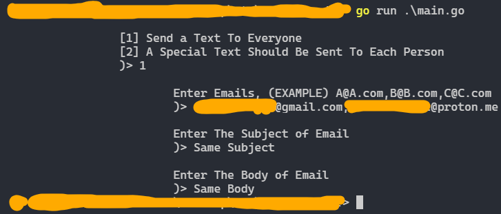
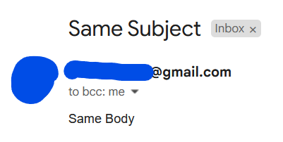
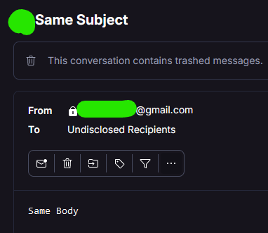
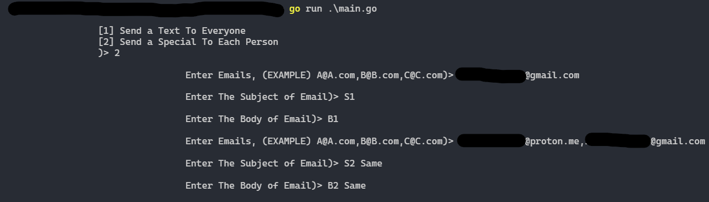
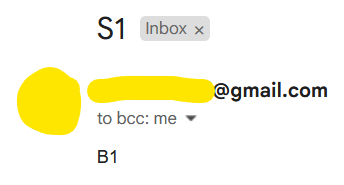
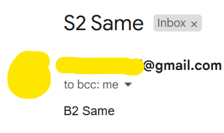
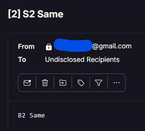

# Email Sender / From `GMAIL` To Every mail

## (📍) How To Run
-  ### 1️⃣) Put your data in `.env` File
    - ```bash
        EMAIL_FROM=YourEmail@gmail.com
        EMAIL_PASSWORD=AAAA BBBB CCCC DDDD
        ```
    - For `EMAIL_PASSWORD` field, go to **https://myaccount.google.com/apppasswords**

<br>

- ### 2️⃣) Run go file
    - ```go
        go run main.go
      ```


## (📍) Result
- ### Option [1]
- ### (💻) App
  - 

<br>

- ### (✉️) Gmail
  - 

<br>

- ### (✉️) ProtonMail
  - 
  
<br>

- ### Option [2]
- ### (💻) App
  - 

<br>

- ### (✉️) Gmail
  - 
  - 

<br>

- ### (✉️) ProtonMail
  - 

